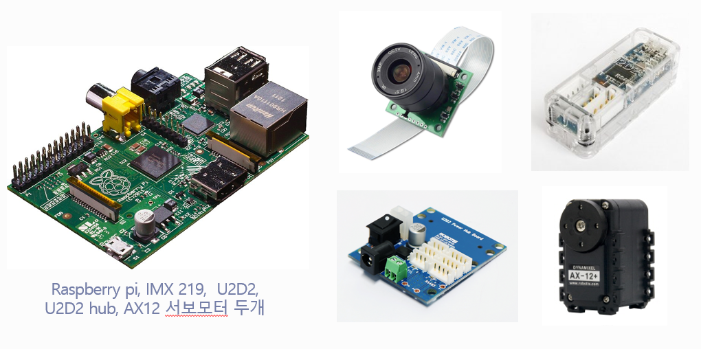

## 비행체 추적 장치 (Wing Tracker)

### 프로젝트 개요

**목표:** 
임베디드장치와 코딩을 활용하여 비행체를 실시간으로 인식하고 추적하는 시스템을 구축
**프로젝트 배경:** 불법 드론이나 레이더에 포착되지 않는 오물 풍선 등으로 인한 피해 및 시민의 불안감 증가에 대한 문제의식에서 시작

### 주요 목표

* **비행체 인식 시스템 구현:** YOLO 알고리즘을 활용하여 카메라 영상에서 비행체를 실시간으로 인식하고 그 위치를 추적하는 시스템을 구축
* **추적 정확도 향상:** YOLO모델을 직접 학습시키고, ROBOFLOW의 데이터에 추가적인 학습을 통해 비행체 추적의 정확도를 향상
* **시제품 제작 및 테스트:** 시스템의 성능을 평가하고 비행체 추적 정확도를 검증하는 임베디드 장치를 제작하고 테스트를 수행

### 기술 개요 및 시스템 설계

#### 객체 탐지 알고리즘: YOLO (You Only Look Once)

YOLO는 이미지나 비디오에서 객체를 실시간으로 인식하고 위치를 파악하는 객체 탐지 알고리즘

* **실시간 객체 탐지:** 
* 단일 신경망을 사용하여 이미지를 한 번에 분석하고 객체를 인식하는 방식을 사용
* 객체 탐지를 회귀 문제로 재구성하여 공간적으로 분리된 경계 상자와 관련 클래스 확률을 직접 예측
* 전체 탐지 파이프라인이 단일 네트워크이기 때문에 탐지 성능에 대해 종단간(end-to-end) 최적화가 가능

* **빠른 처리 속도:** 
* 이미지를 한 번만 처리하여 객체를 탐지하므로 실시간 처리가 가능
* 일부 버전에서는 초당 45프레임 이상을 처리
* YOLO 논문의 기본 모델(Base YOLO)은 초당 45프레임, Fast YOLO는 초당 155프레임으로 이미지를 처리

* **단순하고 효율적인 구조:** Faster R-CNN과 같은 다단계 탐지기보다 간단하고 효율적
* YOLO 논문에서는 R-CNN과 DPM 같은 기존 방식이 분류기를 재활용하거나 복잡한 파이프라인을 사용한다고 설명하며, YOLO는 이를 단일 신경망으로 대체하여 단순하고 빠르다고 언급
* **높은 배경 인식 정확도:** 
* 전체 이미지 맥락을 학습하여 배경 탐지 오류를 줄이고 정확도를 높임
*YOLO는 전체 이미지를 보기 때문에 배경에서 잘못된 탐지(false positives)를 예측할 가능성이 적음

#### 사용 모델: YOLOv11n

* **선택 이유:** 본 프로젝트에서는 라즈베리 파이를 이용
* YOLOv11n은 성능이 낮은 장치에서도 실시간 추적이 가능할 정도로 처리 속도가 빠름
* 모델이 가벼워 각 프레임에 대한 처리 시간이 짧고 ms/img가 적다
* YOLO 모델의 경량화 버전으로 모델 크기가 작아 메모리 사용량도 적다

#### 하드웨어 구성

<table>
  <tr>
    <td></td>
  </tr>
</table>

* **메인 컨트롤러:** Raspberry Pi (프로젝트 초반 Jetson Nano 고려, 안정성 문제로 변경).
* **카메라:** IMX 219.
* **서보 모터 제어:** 
* U2D2 (USB to Dynamixel adapter)
* U2D2 hub
* AX12 서보모터 *2 

`U2D2는 Dynamixel 서보모터를 제어하는 데 사용, USB 포트로 연결사용, 다수의 서보 모터 ID 설정으로 독립 제어 가능. RS-485 통신으로 안정적이고 고속 통신 가능`

#### 서보 모터 제어 방식

1.  YOLO 모델을 활용하여 객체를 실시간으로 감지하고 감지된 객체의 좌표 ($\(x_1, y_1, x_2, y_2\)$) 계산
2.  객체의 중심 좌표 ($\(x_{center}, y_{center}\)$)를 계산하여 서보 모터가 이동해야 할 목표 위치를 결정
    * $\(x_{center} = (x_1 + x_2) / 2\)$
    * $\(y_{center} = (y_1 + y_2) / 2\)$
3.  화면 좌표를 서보 모터의 목표 위치 범위 (DXL\_MIN\_POSITION ~ DXL\_MAX\_POSITION)로 매핑
4.  서보 모터의 ID를 사용하여 X축과 Y축 서보 모터를 개별적으로 제어하며, 목표 위치로 부드럽게 이동하도록 구현
5.  계산된 목표 위치가 지정된 범위를 벗어나지 않도록 유효성 검사 및 보정을 수행
6.  실시간으로 객체를 추적하고, 객체가 화면에 나타날 때마다 서보 모터를 해당 위치로 이동시켜 물리적 공간에서 객체를 추적

### 시제품 개발 과정 하이라이트

* 설계 및 프로토타입 제작.
* 데이터 전처리 및 라벨링 (labelImg 사용, Balloon, UAV, Drone 클래스).
* YOLO 학습 코드 개발.
* 이미지 필터링(Sobel 등)을 적용한 학습 성능 비교 실험 (Original 데이터 학습과 성능 유사하여 미채용).
* Raspberry Pi 카메라 연결 및 외형 제작.
* 서보 모터 제어 구현.

### 테스트 및 결과

* 테스트 방법, 성능 평가, 결과 분석 절차
* **주요 문제점:** 라즈베리 파이 사용으로 인해 초당 1프레임대 성능밖에 구현하지 못함

### 문제점 및 개선사항
* opencv 등 다양한 라이브러리 설치시 버전 오류 문제로 인해 발생할 때 마다 초기화 작업이 필요해 진행이 지연되는 문제가 있었다. 이는 가상환경 virtualenv을 사용, 구축하여 해결하였다.

* jetson nano 보드 사용중 보드의 short가 발생하여 AS를 보냈으나 다시 보드를 받기까지 오래 걸려 급히 라즈베리 파이 보드로 대체하여 진행하였다. 또한 라즈베리 파이의 성능 제약을 해결하기 위해 경량화된 YOLO 모델을 적용하여 프레임 처리 속도를 개선하였다. 경량화된 모델을 사용했기 때문에 기존 모델 기준 정확도가 0.9에서 0.5로 감소해 비행체를 인식하는 성능이 떨어져 아쉬웠다.

* 오물 풍선, 드론, 무인기 등의 특수한 객체를 탐지하는데 필요한 이미지를 수집하는데 어려움을 겪었다. 모델 훈련에는 다양한 각도와 환경에서 촬영된 이미지가 필요했는데, 데이터셋을 구성하는데 한계가 있었다. 이는 데이터 증강 기술을 적극적으로 활용해 충분한 양의 학습 데이터를 제공할 수 있었다.

* 라즈베리 파이를 써서 제작해 초당 1프레임 대 정도의 성능밖에 구현하지 못했다.

* 초당 1프레임 객체 인식과 모터 움직임간의 딜레이가 발생해서, 모터 움직임을 딜레이를 줘서 해결하려 시도하였다. 서보모터 제어 파트(16p) def move_servo_smoothly 함수를 이용하여 해결하였다.

* 카메라의 붉은색 색조현상이 발생하였다. 이를 해결하기 위해 필터 색조값을 일일히 수정하려 하였으나 ISP파라미터를 적용하여 조정하였다.

### 향후 계획

* 레이저 거리 측정기를 추가하여 물체의 정확한 거리와 위치를 파악하고, 이를 통해 좀 더 세밀한 추적 장치를 개발할 계획

* Jetson nano 보드의 AS가 완료된다면, 그를 활용하여 기존 Raspberry pi 기반 시스템에서 발생했던 성능 제약을 극복하고 더욱 강력한 YOLO 모델을 적용하여 실시간으로 처리할 수 있는 추적 장치를 개발할 계획이다. 

### 프로젝트 의의와 최종 성과

* 소형 임베디드 보드를 활용하여 딥러닝 기반의 실시간 객체 추적 시스템을 구현. 저비용, 고효율의 IoT 및 AI 융합 기술 개발의 가능성을 보여주는 사례
* 다양한 비행체를 실시간으로 추적하는 기술을 바탕으로 보안, 물류, 탐사, 환경 모니터링 등 다양한 분야에서의 실질적인 활용 가능성 제시
* 드론, 무인기, 투척 물체 등 다양한 비행체를 정확하게 식별, 추적 가능한 객체 추적 장치 개발
* 하드웨어에서의 성능제약을 해결하는데 최적화된 소프트웨어를 결합해 소형화된 형태의 저비용 솔루션을 구현
* 다양한 임베디드 환경에 적용 가능한 경량 시스템 제작 

